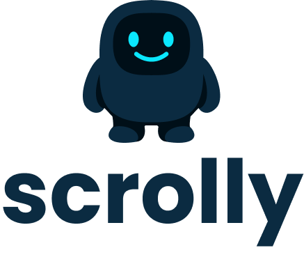

# Scrolly Recruitment Kit

Recruitment task for Scrolly.

## Task

Recreate the UI and simple logic from the Figma design. The app consists of two main screens:

### Home Page
- Header with "scrolly" title
- "Focus time today" section displaying a timer (e.g., "1h 6m 32s") with a time icon
- Scrolly mascot image (changes based on focus state)
- Toggle button: "Tap to focus" / "Tap to unfocus"

### Statistics Page
- Header with "statistics" title
- Two summary cards:
  - **Current days streak** - flame icon, streak count, and "X days overall" pill
  - **Focus time today** - time icon, focus time, and "Xd Xh Xm overall" pill
- Weekly stats section:
  - Focus time/average focus time with period selector
  - Bar chart showing daily focus time (Mon-Sun)
  - Average line indicator

### Time Logic
- Time is counted based on the device's system clock
- "Focus time today" resets to zero every day at midnight
- Statistics must be persisted to local storage and restored after app restart (e.g., using [`shared_preferences`](https://pub.dev/packages/shared_preferences/install) package)

## Figma

The project template is available in Figma (access is needed):
https://www.figma.com/design/qMCuWeHhuO0BRnHaUn2AAh/Scrolly-%E2%80%93-Recruitment-Kit?node-id=7-238&t=xKFhhpXyzvrTt6qi-1

## Project Structure

```
lib/
├── views/        # App screens
├── features/     # Widgets, components and app logic
├── constants/    # Constants (colors, styles, etc.)
assets/
├── icons/        # Icons
├── images/       # Photos and images
```

---

<p align="center">
  
</p>
